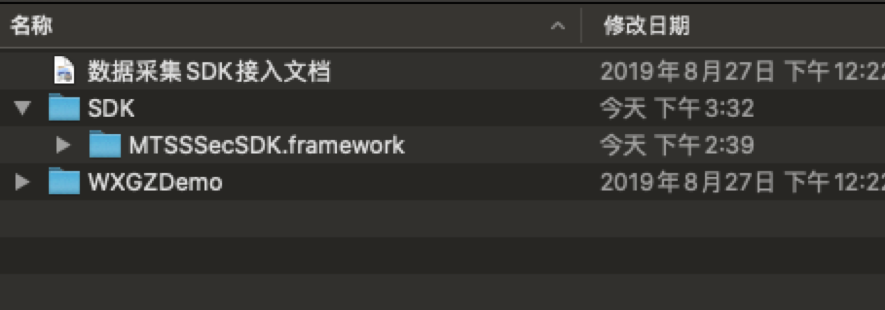

# 轻量化威胁感知iOS SDK 开发指南

SDK     | version | 日期
------- | ---------|---------
iOS     | MTSSSDK 2.0.0 | 2019-9

#### 要求
iOS8.0 和Xcode 9以上
## 一、简介
威胁感知系统通过实时数据采集，数据分析和数据应用，帮助企业闭环APP在运营环境中可能遇到的各种威胁。并将移动威胁态势通过可视化的数据报告呈现给企业运营者。

威胁分类 | 威胁危害| 威胁分析模型 | 规避方式
------- | --------|---------|--------
环境风险| 引起崩溃或用户数据泄露等 | 模拟器、越狱/root、风险进程、恶意应用、LIBC内核破坏、域名风险和系统签名破坏等 | 禁止运行客户端
业务威胁  | 欺诈、薅羊毛等 | 位置欺诈、系统加速、设备复用和自定义组合分析等 | 预警并中断操作
基础攻击 | 影响正常运行或盗取核心数据等 |框架、调试、注入、病毒木马、设备篡改、界面劫持和域名劫持等 | 中断并上报

## 二、 准备
接入前期准备工作包含:获取 AppKey以及 SDK 文件（已完成用户可略过此步骤）
### （1）获取AppKey
AppKey为接入 SDK 的必要参数，参数值需要到管理平台去创建应用获取；对于本地化部署，则需要在本地服务器上进行登陆管理页面进行分配Appkey参数。具体操作步骤如下：登入管理平台，在左侧菜单【系统配置】选项下选择【应用管理】
1.打开应用管理模块，在右侧点击上传应用。见图1-1-1
     <br>
2.提交完成，应用列表点击查看 AppKey。见图1-1-2 
      <br>


### （2）目录结构
注：使用CocoaPods的用户可以通过如下名称管理智八哥：
```ruby
pod 'MTSSSDK', '~> 2.0.0'
```

 注意（搜索之前在终端更新下pod）
```ruby
rm ~/Library/Caches/CocoaPods/search_index.json
Pod setup
```
登入管理平台，在左侧菜单【系统配置】选项下选择【SDK 管理】，选择数据采集 SDK 下载 iOS 版本。（文件夹目录如下图1-2-1）
    <br>
  

## 三、 集成
 把下载下来的SDK 包拖进工程内（包含: MTSSSecSDK.framework、MTSSSecSDK.bundle）

### （1）集成SDK
 在项目build phases如下图所示配置
   <br>
 

### （2）工程配置
 1、在工程文件中选择 Build Setting，在"Other Linker Flags"中加入"-ObjC"（注意区分大小写）。
   <br>


 2、在你的工程文件中选择 Build Setting，在"Enable Bitcode"栏选择 NO。见下图
   <br>

###  (3）数据采集SDK对接
1、在AppDelegate.m文件里面导入SDK头文件
    #import <MTSSSecSDK/MTSSSecSDK.h> 
2、初始化SDK
在AppDelegate.m文件didFinishLaunchingWithOptions方法中初始化SDK
   <br>

## 四、FAQ
### (1)、 网络请求失败
 如果你的 App 基于 iOS 9.0 编译，那么为了适配 iOS 9.0 中的 App Transport Security(ATS)对 HTTP 的限制，在 App 对应的 Info.list 中添加如下配置。（如果采用https方式则无需进行配置）
```ruby
<key>NSAppTransportSecurity</key>
<dict>
<key>NSAllowsArbitraryLoads</key><true/>
</dict>
```

### (2)、 授权失败处理

  首次启动用户拒绝推送或定位授权后，在 AppDelegate.m 的 didFinishLaunchingWithOptions 方法内加入 SDK 提供接口方法，可设置每次启动 App 时开启检测并提示去设置的授权弹框。（注：默认授权弹窗只在首次运行 App 弹出一次，特定的授权类型在设置 YES 之后，如果检测到未授权，每次启动 App 都会弹窗提示用户去设置）具体设置如下图所示:
   <br>
 
 
### (3)、崩溃分析日志异常
 发生崩溃以后，在管理中心并没有找到崩溃日志。可能是由于以下4种情况造成：
1.  崩溃以后没有重新启动app，因为崩溃的时候来不及发送崩溃日志给服务器。所以需要重新启动app来进行网络请求发送日志到服务器。
2.  iOS 捕获异常的函数NSSetUncaughtExceptionHandler()被其他的崩溃收集类覆盖。导致威胁感知SDK捕获不到NSSetUncaughtExceptionHandler的回调消息。解决的办法是找出其他的崩溃收集类，再其捕获异常的时候先判断是否已经有其他的handle已经设置。可以先将该handle保存，然后将在收集完成异常以后回调该handle。如图所示
      <br>
     <br>
  
3. 没有连接网络，导致日志没法上报。
4. 发生崩溃的时候app还是断点状态，导致无法保存崩溃信息，放开断点即可完成崩溃信息收集。
